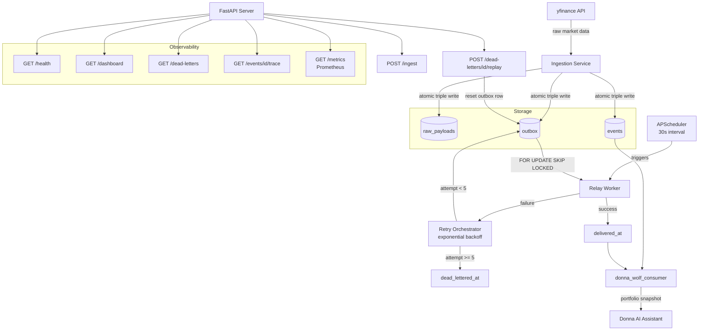

# AI Control Plane

> Event-driven infrastructure that makes non-deterministic AI models safe for production.

Built in public as part of **#100DaysOfCode** — Days 32–50.

---

## What This Is

The AI Control Plane is a production-grade event orchestration layer built from scratch in Python. It ingests real-time market data, transforms it into canonical events, and delivers those events reliably to downstream consumers — with full retry orchestration, dead-letter handling, replay capability, structured observability, and a live operational dashboard.

It is not a tutorial project. It is not a CRUD app. It is infrastructure.

The system was designed to solve a real problem: Donna, my local AI assistant, was calling yfinance directly — no retry, no audit trail, no traceability. The Control Plane replaces that direct call with a reliable, observable, structured event pipeline. Donna is now a downstream consumer. If the data source fails, the Control Plane retries. If it exhausts retries, it dead-letters and surfaces the failure via API. If you fix the issue, you replay the event. No data loss. No silent failures.

---

## Architecture


---

## Quick Start

The entire system runs with one command. No virtualenv. No manual setup.
```bash
docker compose -f docker/docker-compose.yml up
```

Then visit:
- **Dashboard** → `http://localhost:8000/dashboard`
- **Health** → `http://localhost:8000/health`
- **Metrics** → `http://localhost:8000/metrics`

---

## API Surface

### `GET /health`
Full system status — not a ping, a real health check.
```json
{
  "status": "ok",
  "scheduler": "running",
  "pending_events": 0,
  "dead_lettered_events": 2,
  "delivered_events": 14,
  "last_delivered_at": "2026-03-19T11:52:44.828028+00:00"
}
```

---

### `GET /dashboard`
Live HTML operational dashboard. Auto-refreshes every 30 seconds. Shows scheduler status, delivery counts, queue depth, and dead-letter table. No database access required.

---

### `POST /ingest`
Trigger multi-symbol ingestion via API. Each symbol becomes an independent canonical event with its own `event_id` and `trace_id`.
```bash
curl -X POST http://localhost:8000/ingest \
  -H "Content-Type: application/json" \
  -d '["AAPL", "GOOGL", "TSLA"]'
```
```json
{
  "ingested": [
    {"event_id": "b04e6d11-...", "trace_id": "0f7b937f-...", "symbol": "AAPL"},
    {"event_id": "dbf0d91b-...", "trace_id": "2f399b45-...", "symbol": "GOOGL"},
    {"event_id": "641cb4f8-...", "trace_id": "b513b8fb-...", "symbol": "TSLA"}
  ]
}
```

---

### `GET /dead-letters`
List all dead-lettered events — events that exhausted all retry attempts.
```json
[
  {
    "event_id": "304b626d-...",
    "topic": "market.ticks",
    "delivery_attempts": 5,
    "last_error": "Simulated publish failure",
    "dead_lettered_at": "2026-02-18T14:36:19+00:00",
    "event_type": "MARKET_TICK_INGESTED",
    "entity_id": "AAPL"
  }
]
```

---

### `GET /dead-letters/{event_id}`
Full forensic detail on a specific dead-lettered event — payload, trace_id, error, timestamps.

---

### `POST /dead-letters/{event_id}/replay`
Requeue a dead-lettered event for redelivery. Resets attempts, clears error, sets `next_attempt_at` to now. The scheduler picks it up within 30 seconds automatically.
```json
{"event_id": "304b626d-...", "status": "requeued"}
```

---

### `GET /events/{event_id}/trace`
Reconstruct the complete lifecycle of any event in a single API call.
```json
{
  "event_id": "304b626d-...",
  "trace_id": "8495a3a9-...",
  "final_state": "DEAD_LETTERED",
  "event": {
    "event_type": "MARKET_TICK_INGESTED",
    "entity_id": "AAPL",
    "occurred_at": "2026-02-13T15:59:00+00:00",
    "payload": {"price": 255.82, "volume": 1420615, "currency": "USD"}
  },
  "outbox": {
    "delivery_attempts": 5,
    "last_error": "Simulated publish failure",
    "dead_lettered_at": "2026-02-18T14:36:19+00:00"
  }
}
```

---

### `GET /metrics`
Prometheus-compatible metrics endpoint. Exposes event counters and publish latency histogram.
```
events_published_total
events_failed_total
events_dead_lettered_total
publish_latency_seconds
```

---

## Core Design Decisions

### Transactional Outbox Pattern
Every ingestion writes atomically to three tables — `raw_payloads`, `events`, and `outbox` — in a single database transaction. Either all three succeed or none do. There is no window where an event exists in the store but not in the outbox, or vice versa.

### Concurrency-Safe Relay
The relay worker claims outbox rows using `FOR UPDATE SKIP LOCKED`. Multiple relay workers can run simultaneously without double-processing a single event. Safe for horizontal scaling.

### Delivery Attempts at Claim Time
`delivery_attempts` increments when a row is *claimed*, not when it is *processed*. This means if the worker crashes between claim and publish, the attempt is still counted. The system never silently under-counts failures.

### Exponential Backoff
Failed events are rescheduled using `[2, 5, 15, 30, 60]` seconds. After 5 attempts the event is dead-lettered. Operators can inspect via `/dead-letters` and replay via `/dead-letters/{id}/replay` without touching the database.

### Autonomous Scheduler
The relay runs on a 30-second APScheduler interval inside the FastAPI process. The system is fully self-operating — no cron jobs, no manual triggers, no external orchestration required.

### trace_id Propagation
Every event carries a `trace_id` from ingestion through delivery. The `/events/{id}/trace` endpoint reconstructs the full lifecycle — ingestion timestamp, delivery attempts, final state — using this ID as the thread.

---

## Consumer Layer

`app/consumers/donna_wolf_consumer.py` reads the most recently delivered market event for any symbol directly from the event store. Donna's Wolf module calls this instead of hitting yfinance directly.
```python
from app.consumers.donna_wolf_consumer import get_portfolio_snapshot

snapshot = get_portfolio_snapshot(["AAPL", "GOOGL", "TSLA"])
# Returns latest delivered canonical event per symbol
# With price, volume, trace_id, delivered_at
```

This is the bridge between the Control Plane and Donna. Market data is reliable, structured, and traceable before it reaches the AI layer.

---

## Test Suite
```bash
python -m pytest tests/ -v
```
```
tests/test_ingestion.py::TestFetchMarketData::test_returns_expected_fields         PASSED
tests/test_ingestion.py::TestFetchMarketData::test_raises_on_empty_data            PASSED
tests/test_ingestion.py::TestIngestSymbol::test_returns_event_id_and_trace_id      PASSED
tests/test_relay.py::TestRunRelay::test_no_events_does_nothing                     PASSED
tests/test_relay.py::TestRunRelay::test_successful_publish_marks_delivered         PASSED
tests/test_relay.py::TestRunRelay::test_failed_publish_marks_failed                PASSED
tests/test_relay.py::TestRunRelay::test_multiple_events_processed_independently    PASSED
tests/test_repository.py::TestMarkDelivered::test_executes_update                  PASSED
tests/test_repository.py::TestMarkFailed::test_schedules_retry_below_max           PASSED
tests/test_repository.py::TestMarkFailed::test_dead_letters_at_max_attempts        PASSED
tests/test_repository.py::TestGetDeadLetters::test_returns_empty_list_when_none    PASSED
tests/test_repository.py::TestGetDeadLetters::test_returns_formatted_list          PASSED
tests/test_repository.py::TestGetEventTrace::test_returns_none_when_event_not_found PASSED

13 passed in 0.77s
```

All database and transport calls are mocked. Tests run without Docker or network access.

---

## Stack

| Component | Technology | Why |
|---|---|---|
| API Server | FastAPI + Uvicorn | Async, fast, clean endpoint definitions |
| Scheduler | APScheduler | In-process background scheduling, no external deps |
| Database | PostgreSQL 15 | ACID transactions, `FOR UPDATE SKIP LOCKED` |
| DB Driver | psycopg v3 | Native async support, transaction context managers |
| Metrics | prometheus-client | Industry standard, Grafana-compatible |
| Data Source | yfinance | Real market data, no API key required |
| Containerisation | Docker + Docker Compose | One-command startup, environment agnostic |
| Runtime | Python 3.11 | Match production, use modern type hints |
| Tests | pytest + pytest-mock | Fast, isolated, no infrastructure required |

---

## Build Log — Days 32–50

| Day | Focus |
|---|---|
| 32 | Canonical event contract + Transactional Outbox schema |
| 33 | Ingestion service — atomic triple write |
| 34 | Relay worker — concurrency-safe delivery |
| 35 | Retry lifecycle + dead-lettering |
| 36 | Structured JSON logging |
| 37 | Prometheus metrics |
| 38 | Latency histogram + performance telemetry |
| 39 | APScheduler — autonomous relay |
| 40 | Dead-letter inspection API |
| 41 | Event lifecycle trace endpoint |
| 42 | Dead-letter replay |
| 43 | Consumer layer — Donna integration |
| 44 | System status endpoint |
| 45 | Unified operational dashboard |
| 46 | Multi-symbol ingestion + POST /ingest |
| 47 | Test suite — 13 tests, 0 failures |
| 48 | Dockerized API server |
| 49 | Architecture diagram |
| 50 | This README |

---

## What's Next

The Control Plane is the backbone. Donna is the brain.

Days 56–100 of #100DaysOfCode return to Donna — now with the Control Plane as her nervous system. Wolf reads from the event store. Data is reliable, traced, and replayable before it reaches the AI layer.

---

*Built by Aryaman Sondhi — #100DaysOfCode, 2026*