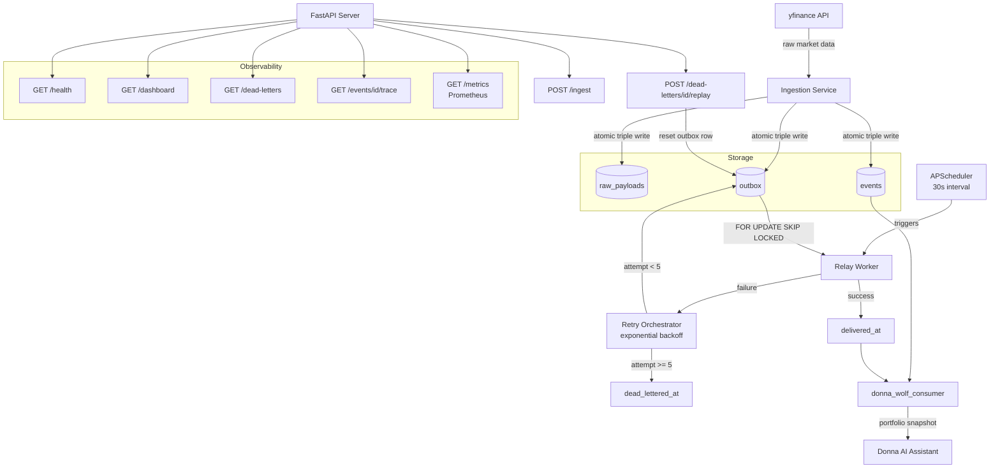

# AI Control Plane — Architecture

## System Overview

The AI Control Plane is an event-driven infrastructure layer that provides
reliable, observable, and traceable market data delivery to downstream consumers.

## Architecture Diagram


## Component Responsibilities

**Ingestion Service** — Fetches market data from yfinance and atomically writes
to all three tables in a single transaction. No partial writes. No silent failures.

**Relay Worker** — Polls the outbox using `FOR UPDATE SKIP LOCKED` for
concurrency-safe claiming. Publishes events and transitions state on success or failure.

**Retry Orchestrator** — Schedules failed events for redelivery using exponential
backoff `[2, 5, 15, 30, 60]` seconds. Dead-letters after 5 attempts.

**APScheduler** — Runs the relay worker every 30 seconds inside the FastAPI process.
The system is fully autonomous — no manual triggers required.

**Consumer Layer** — Reads delivered events from the event store. Donna's Wolf
consumes market data from here instead of calling yfinance directly.

**API Surface** — Full operational control plane: health, metrics, ingestion,
dead-letter inspection, replay, and event lifecycle tracing.

## Data Flow
```
POST /ingest → Ingestion → [raw_payloads + events + outbox]
                                          ↓
                              APScheduler (30s) → Relay Worker
                                          ↓
                              delivered_at ← → retry → dead_lettered_at
                                          ↓
                              donna_wolf_consumer → Donna
```

## Stack

| Component | Technology |
|---|---|
| API Server | FastAPI + Uvicorn |
| Scheduler | APScheduler |
| Database | PostgreSQL 15 |
| DB Driver | psycopg v3 |
| Metrics | Prometheus client |
| Data Source | yfinance |
| Containerisation | Docker + Docker Compose |
| Runtime | Python 3.11 |
| Tests | pytest + pytest-mock |